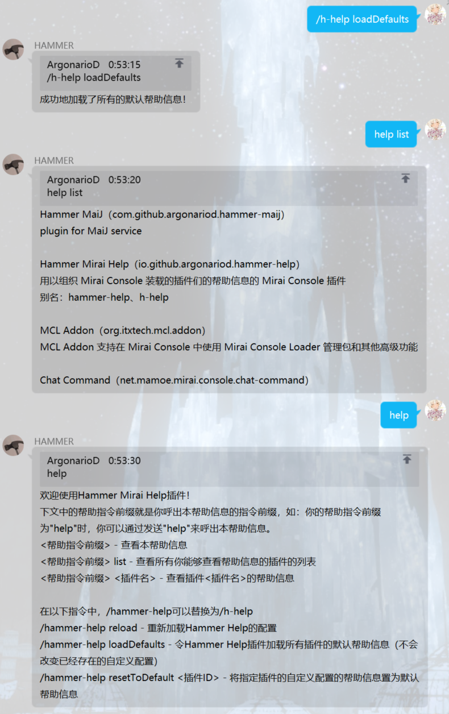
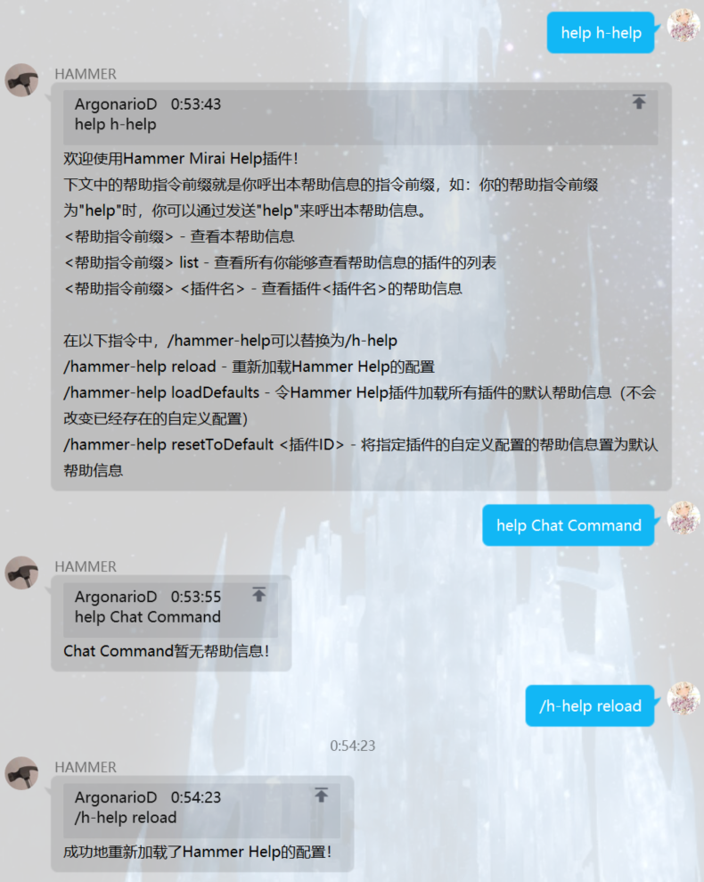
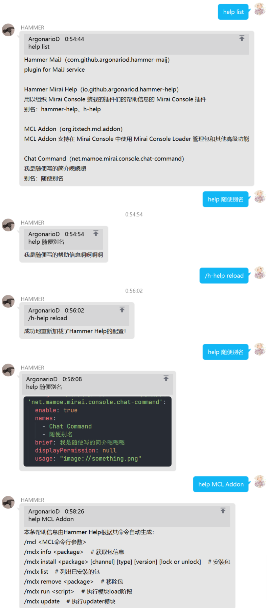

<div align="center">


# Hammer Mirai Help
一个用以组织 Mirai Console 装载的插件们的帮助信息的 Mirai Console 插件。

为 Mirai Console 的用户提供统一的、简单的、可高度自定义的帮助信息展示方式。

为 Mirai Console 的插件开发者提供简单且统一的帮助信息展示方式和接口。

<a href="https://raw.githubusercontent.com/ArgonarioD/hammer-mirai-help/main/LICENSE">
   
</a>

</div>

## 本插件针对的一些问题
 - 用一个帮助指令显示机器人所有功能会让对话十分冗余；
 - 自行编写并维护一个帮助指令比较麻烦，且可能容易漏掉新加的插件，对于硬编码实现的帮助指令每次需要重新构建部署；
 - 大部分自动生成的帮助指令只能对插件注册的命令进行帮助提示，无法对基于事件系统的指令进行提示；
 - 需要修改其他插件提供的帮助信息；
 - 可能需要使用自定义图片的作为帮助指令，并且需要热重载来实时进行修改；
 - 等。

## 功能
 - 安装新插件后，用户只需要执行一行指令即可自动配置该插件的帮助信息：
   - 对于接入本插件接口的插件，本插件会按照其配置的帮助信息进行配置；
   - 对于未接入本插件接口的插件，本插件会依据其注册的指令自动生成帮助信息。
 - 对于用户来说，只需要通过修改配置文件就可以修改如下的信息：
   - 触发帮助的指令前缀（可以使用正则表达式匹配）；
   - 指定插件的帮助信息是否启用；
   - 指定插件的名称以及别名；
   - 指定插件的详细帮助信息内容（可以设置为图片）；
   - 用户想要看到指定插件的帮助信息所需要的权限（可以为空）。
 - 对于插件开发者来说，接入本插件十分简单：
   - 对于 JVM 插件，通过本插件提供的 SDK 在插件代码添加几行代码即可进行配置；
   - 对于其他插件，只需要在指定目录生成一个配置文件即可。
 - 无插件依赖要求，接入本插件的接口后不安装本插件无法使用 `help` 功能，但可以正常运行。

## 快速开始
### 安装
#### 通过 Mirai Console Loader 安装 （推荐）
在 `mcl` 所在的文件夹下执行
```shell
./mcl --update-package io.github.argonariod:hammer-mirai-help --channel stable --type plugin
```
然后再启动 Mirai Console Loader 即可。
#### 手动安装
在右侧的 `Release` 处下载最新的 `.jar` 文件，将其放入 `plugins` 目录下，重启 Mirai Console 。
### 第一次启动
使用指令
```
/h-help loadDefaults
```
看到成功提示后，在 Bot 所在的任意一个QQ群聊中输入
```
help
```
即可看到帮助信息。

## 详细文档
 - [GitHub Wiki](https://github.com/ArgonarioD/hammer-mirai-help/wiki/%E4%B8%BB%E9%A1%B5)（包含用户手册和开发者手册）

## 鸣谢
 - [Mirai](https://github.com/mamoe/mirai)
 - [nonebot-plugin-help](https://github.com/XZhouQD/nonebot-plugin-help): 本插件的灵感来源

## 部分功能效果预览图



---
   ~~*如果觉得有用的话求点个Star啵QwQ*~~